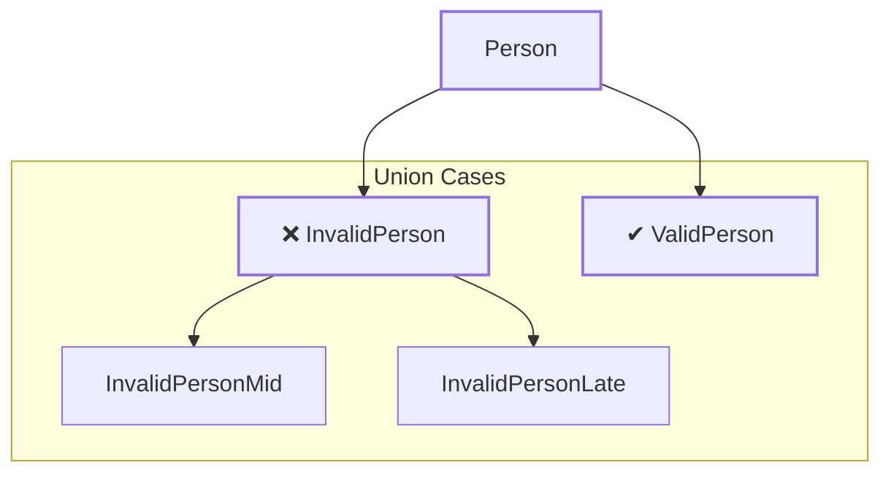
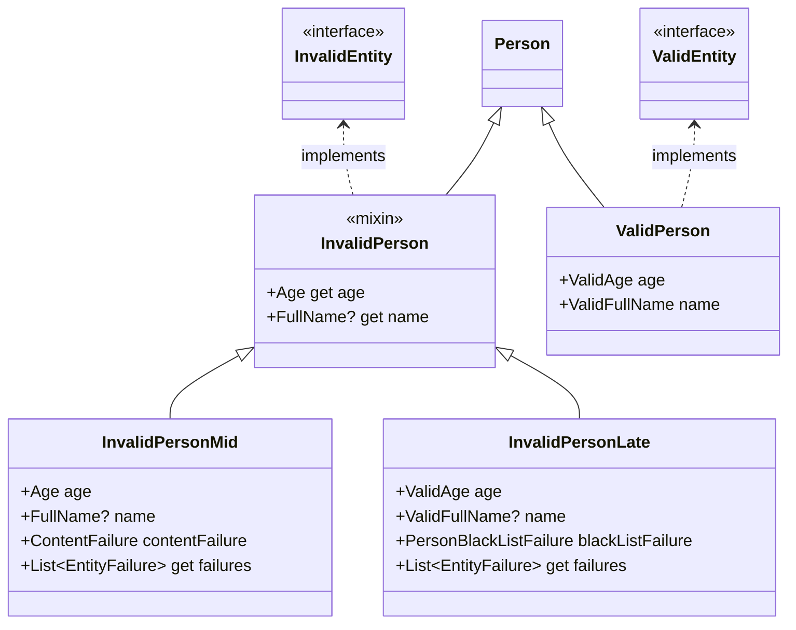
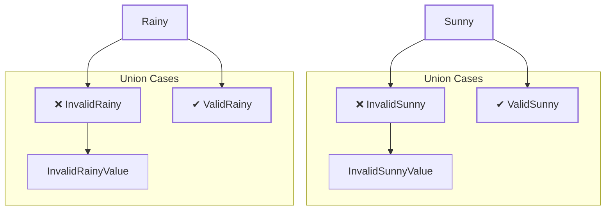
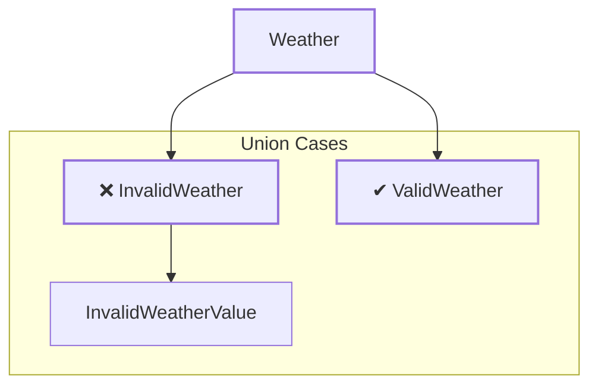
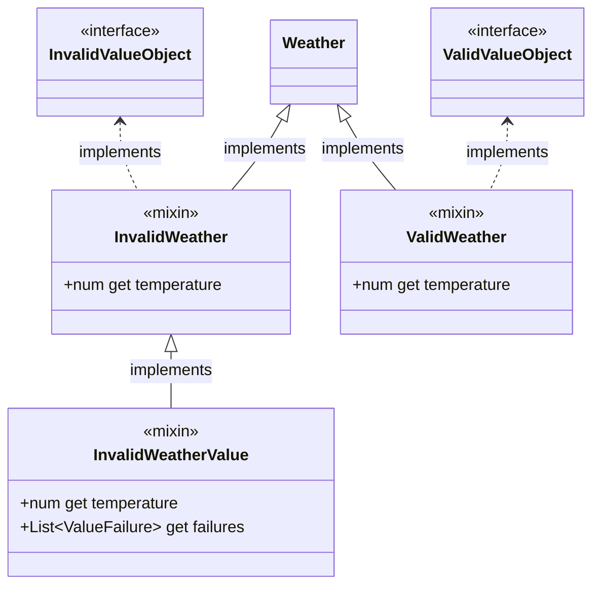
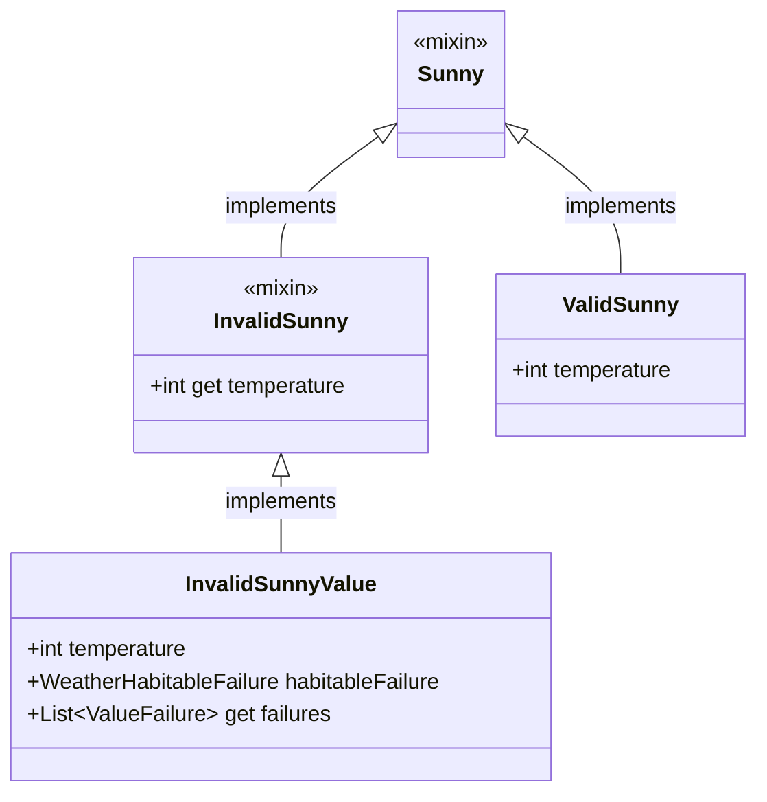
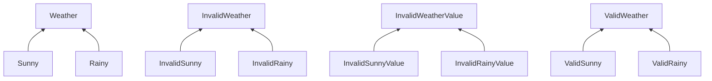
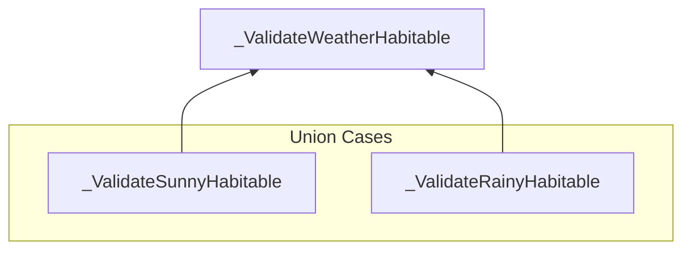

# Introduction

Before reading this document, you should read [`internal.md`](internal.md).

This document aims to provide an in-depth understanding of the various components (or "templates") that make up the generated code.

# Table of Contents

- [Introduction](#introduction)
- [Table of Contents](#table-of-contents)
- [Anatomy of a generated Modddel file](#anatomy-of-a-generated-modddel-file)
  - [Generated for all](#generated-for-all)
  - [Generated for the annotated class](#generated-for-the-annotated-class)
    - [Modddel template](#modddel-template)
    - [SSealed template](#ssealed-template)
- [Generalities](#generalities)
- [Solo modddel](#solo-modddel)
  - [The modddel classes](#the-modddel-classes)
  - [The Holders](#the-holders)
  - [The SubHolders](#the-subholders)
  - [Converting from Holder to Subholder](#converting-from-holder-to-subholder)
  - [The instance method](#the-instance-method)
  - [Creating and Validating a Modddel](#creating-and-validating-a-modddel)
    - [The validate method](#the-validate-method)
    - [The verifyStep method](#the-verifystep-method)
    - [The create method](#the-create-method)
  - [Validness Pattern Matching](#validness-pattern-matching)
  - [Equality](#equality)
  - [ToString](#tostring)
  - [WithGetter getters](#withgetter-getters)
  - [CopyWith](#copywith)
  - [Dependencies](#dependencies)
- [Union of Modddels](#union-of-modddels)
  - [The super-sealed classes](#the-super-sealed-classes)
  - [The modddel classes](#the-modddel-classes-1)
  - [Holders \& Subholders](#holders--subholders)
  - [The instance method](#the-instance-method-1)
  - [Creating and Validating a Modddel](#creating-and-validating-a-modddel-1)
    - [The create method \& The verifySteps methods](#the-create-method--the-verifysteps-methods)
    - [The validate method](#the-validate-method-1)
  - [ToEither and ToBroadEither](#toeither-and-tobroadeither)
  - [Validness Pattern Matching](#validness-pattern-matching-1)
  - [Modddel Pattern Matching](#modddel-pattern-matching)
  - [Equality](#equality-1)
  - [ToString](#tostring-1)
  - [WithGetter getters](#withgetter-getters-1)
  - [CopyWith](#copywith-1)
  - [Dependencies](#dependencies-1)
- [Variations](#variations)
  - [IterableEntity variations](#iterableentity-variations)
    - [The validateContent method](#the-validatecontent-method)
    - [Type-casting in verifyStep methods](#type-casting-in-verifystep-methods)
    - [The verifyNullables method](#the-verifynullables-method)
  - [Iterable2Entity variations](#iterable2entity-variations)
    - [The validateContent method](#the-validatecontent-method-1)
    - [Type-casting in verifyStep methods](#type-casting-in-verifystep-methods-1)
    - [The verifyNullables method](#the-verifynullables-method-1)
- [Unit-testing Modddels](#unit-testing-modddels)
  - [The Tester class](#the-tester-class)
  - [The InvalidStepTest(s)](#the-invalidsteptests)
  - [The ModddelParams](#the-modddelparams)
    - [ModddelParams \& Solo annotated class](#modddelparams--solo-annotated-class)
    - [ModddelParams \& Super-sealed annotated class](#modddelparams--super-sealed-annotated-class)

# Anatomy of a generated Modddel file

## Generated for all

These are included at the top of the generated file **once**, no matter how many annotated classes the source file contains.

- **UnimplementedError variable :** This is a variable for an `UnsupportedError`, which is thrown when trying to access an instance member from within the annotated class or after constructing the annotated class using the private constructor.
  
  ```dart
  final _$unimplementedError = UnsupportedError( //... error message
  ```

- **CopyWithDefault constant :** This is an arbitrary constant used by the `copyWith` method.

  ```dart
  class _$CopyWithDefault {
    const _$CopyWithDefault();
  }

  const _$copyWithDefault = _$CopyWithDefault();
  ```

## Generated for the annotated class

The following templates are generated for each annotated class :

**If the annotated class is solo :**

- [**Modddel template**](#modddel-template)
- If `generateTestClasses` is true :
  - **Tester template**
  - For each validationStep : **InvalidStepTest template**

**If the annotated class is super-sealed :**

- [**SSealed template**](#ssealed-template)
- For each case-modddel : [**Modddel template**](#modddel-template)
- If `generateTestClasses` is true :
  - **Tester template**
  - For each validationStep : **InvalidStepTest template**

### Modddel template

Includes the following templates :

- **Base class modddel template :** Template for the base modddel class.
  - If the modddel is solo : It's a mixin that is mixed-in by the annotated class (= top-level mixin).
  - If the modddel is a case-modddel : It's a stand-alone mixin. _(it's a mixin and not an abstract class only for multi-inheritance purposes, following [rule M1](#generalities))_
- **Valid modddel template :** Template for the valid union-case class.
- **Invalid modddel template :** Template for the abstract invalid union-case class.
- **ValidationSteps modddel template :** Template for the classes of the validationSteps. Includes for each validationStep :
  - **Invalid step modddel template :** Template for the invalid-step union-case class
  - **Holder modddel template**
  - For each validation : **Subholder modddel template**
- If the modddel has dependency parameters : **Dependencies modddel template**
- If `generateTestClasses` is true : **ModddelParams modddel template**

### SSealed template

Includes the following templates :

- **Base class ssealed template :** Template for the base ssealed class. It's a mixin that is mixed-in by the annotated class (= top-level mixin).
- **Valid ssealed template :** Template for the valid super-sealed class.
- **Invalid ssealed template :** Template for the invalid super-sealed class.
- **ValidationSteps ssealed template :** Template for the classes of the validationSteps. Includes for each validationStep :
  - **Invalid step ssealed template :** Template for the invalid-step super-sealed class.
  - For each validation : **Subholder ssealed template :** Template for the super-sealed subholder of the validation.
- If `generateTestClasses` is true :
  - **ModddelParams ssealed template :** Template for the super-sealed ModddelParams class.

# Generalities

- **Rule M1 :** For multi-inheritance purposes, all abstract classes that inherit (directly or indirectly) from the annotated class are instead mixins that implement it (directly or indirectly). The concrete subclass(es) can then extend the annotated class, and mix-in all its other superclasses (direct AND indirect).

  Example 1 : The annotated class is `Person`. `InvalidPerson` is a subclass of `Person`, and `InvalidPersonMid` is a concrete subclass of `InvalidPerson`.
  
  ```mermaid
  graph BT
    A[Person]
    B[InvalidPerson]
    C[InvalidPersonMid]
    C --> B --> A
  ```
  
  ```dart
  mixin InvalidPerson implements Person //...

  // `InvalidPersonMid` extends the annotated class `Person`, and mixes-in  
  // its other superclass `InvalidPerson`
  class InvalidPersonMid extends Person with InvalidPerson //...
  ```

  Example 2 :
  
  For example : The annotated class is `Weather`. Both `ValidWeather` and `Sunny` are subclasses of `Weather`. `ValidSunny` is a concrete subclass of both `ValidWeather` and `Sunny`.

  ```mermaid
  graph BT
    A[Weather]
    B[ValidWeather]
    C[Sunny]
    D[ValidSunny]
    B & C --> A
    D --> B & C
  ```
  
  ```dart
  mixin ValidWeather implements Weather //...

  mixin Sunny implements Weather //...

  // ValidSunny extends the annotated class `Weather`, and mixes-in its other
  // superclasses `ValidWeather` and `Sunny`.
  class ValidSunny extends Weather with ValidWeather, Sunny //...

  ```

- **Rule M2 :** In the context of a Union of modddels, the fields of the mixins may have different types across the different case-modddels. To avoid type mismatch between fields during multi-inheritance using mixins, the mixins don't contain the fields themselves, but rather they implement an interface (an abstract class) that contains those fields. We call this kind of interfaces a **FieldsInterface**.

  Example :

  ```dart
  abstract class _$InvalidWeatherFields {
    // All fields of `InvalidWeather` go here.
    num get temperature;
  }

  mixin InvalidWeather
      implements Weather, InvalidValueObject, _$InvalidWeatherFields {
    // ...
  }
  ```

  _NB : If the mixin doesn't have any field, the FieldsInterface is not generated/used._

- **Rule M3 :** For ease of use, the annotated class is not abstract. As a result, all getters and methods are implemented in the top-level mixin (except the validate methods which are meant to be overridden by the developer). As a result, the methods/getters that should be abstract instead throw an unimplemented error, but are overridden in all concrete subclasses anyways.

# Solo modddel

Let's take this as an example :

```dart
@Modddel(
  validationSteps: [
    ValidationStep([
      contentValidation,
    ]),
    ValidationStep([
      Validation('blackList', FailureType<PersonBlackListFailure>()),
    ])
  ],
)
class Person extends SimpleEntity<InvalidPerson, ValidPerson> with _$Person {
  Person._();

  factory Person({
    required Age age,
    @NullFailure('blackList', PersonBlackListFailure.unnamed())
      required FullName? name,

  }) {
    return _$Person._create(age: age, name: name);
  }

  @override
  Option<PersonBlackListFailure> validateBlackList(person) {
    if (person.name.firstName == 'Dash' &&
        person.name.lastName == 'Birdy' &&
        person.age.value == 28) {
      return some(const PersonBlackListFailure.blackListed());
    }
    return none();
  }
}

@freezed
class PersonBlackListFailure extends ValueFailure
    with _$PersonBlackListFailure {
  const factory PersonBlackListFailure.blackListed() = _BlackListed;
  const factory PersonBlackListFailure.unnamed() = _Unnamed;
}
```



## The modddel classes

In addition to the base modddel mixin (`_$Person`) that is mixed-in by the annotated class (`Person`), there are 3 kinds of generated union-cases : The abstract invalid union-case (`InvalidPerson`), an invalid-step union-case for each validationStep (`InvalidPersonMid` - `InvalidPersonLate`), and the valid union-case (`ValidPerson`).

- The abstract invalid union-case : `InvalidPerson`

```dart
mixin InvalidPerson implements Person, InvalidEntity {

  Age get age;

  FullName? get name;

  // ...
}
```

- The first invalid-step union-case : `InvalidPersonMid`

```dart
class InvalidPersonMid extends Person with InvalidPerson {

  @override
  final Age age;

  @override
  final FullName? name;

  final ContentFailure contentFailure;


  @override
  List<EntityFailure> get failures => [contentFailure];
  
  // ...
}
```

- The second invalid-step union-case : `InvalidPersonLate`

```dart
class InvalidPersonLate extends Person with InvalidPerson {
  
  @override
  final ValidAge age;

  @override
  final ValidFullName? name;

  final PersonBlackListFailure blackListFailure;


  @override
  List<EntityFailure> get failures => [blackListFailure];
  
  // ...
}
```

- The valid union-case : `ValidPerson`

```dart
class ValidPerson extends Person implements ValidEntity {

  final ValidAge age;

  final ValidFullName name;

  // ...
}
```



As you can see :

**Class Hierarchy :**

- The valid union-case (`ValidPerson`) is a concrete class that extends the annotated class (`Person`).
- [_Following rule M1 :_](#generalities) : The abstract invalid union-case (`InvalidPerson`) is a mixin that implements the annotated class (`Person`). The two invalid-step union-cases (`InvalidPersonMid` and `InvalidPersonLate`) are concrete classes that extend the annotated class (`Person`) and mix-in the abstract invalid union-case (`InvalidPerson`).
- The valid union-case (`ValidPerson`) implements `ValidEntity`, and the abstract invalid union-case (`InvalidPerson`) implements `InvalidEntity`.
- _NB : If the modddel was a ValueObject, these would have been `ValidValueObject` and `InvalidValueObject` instead._

**Fields :**

- The valid union-case (`ValidPerson`) holds the member parameters as properties with the transformations correctly applied.
- The abstract invalid union-case (`InvalidPerson`) has abstract getters for the member parameters. These are then overridden in the invalid-step union-cases (`InvalidPersonMid` and `InvalidPersonLate`) in the form of properties, with the transformations correctly applied.
- The invalid-step union-cases also hold their specific failure(s) field(s) and the general `failures` getter.

> **NB :** If an invalid-step union-case has only one possible failure, then its field type is non-nullable. However, if it has more than one possible failure, then the failures fields are nullable, and "hasFailure" getters are generated.

## The Holders

There is a "holder" class for each validationStep. A holder is a class that holds the fields of a validationStep. These fields are simply the member parameters with all transformations of the previous validationSteps applied.

For example :

- The holder of the 'Mid' validationStep :

```dart
class _$PersonMidHolder {
  _$PersonMidHolder({required this.age, required this.name});

  final Age age;
  final FullName? name;
}
```

- The holder of the 'Late' validationStep :

```dart
class _$PersonLateHolder {
  _$PersonLateHolder({required this.age, required this.name});

  final ValidAge age;
  final ValidFullName? name;

  // ...
}
```

## The SubHolders

There is a "subholder" class for each validation. It is the class that is passed to the "validate method" of the validation [(see validate methods)](#the-validate-method).

Example :

```dart
// The subholder is "_ValidatePersonBlackList"
Option<PersonBlackListFailure> validateBlackList(_ValidatePersonBlackList person);
```

The subholder holds the fields of the parent validationStep of the validation **after** the `NonNullParamTransformation`s that refer to the validation have been applied.

Example :

```dart
class _ValidatePersonBlackList {
  _ValidatePersonBlackList({required this.age, required this.name});

  final ValidAge age;
  // Notice how this is non-nullable, because the '@NullFailure' refers
  // to the 'blackList' validation.
  final ValidFullName name;
}
```

> **NB :** The subholder has two goals :
>
> - It is passed to the validate method that the developer will implement, so it should be aesthetic (consistent and meaningful naming, no internal fields and methods), and have some functionnalities (modddel pattern matching in the context of union of modddels).
> - It holds the non-nullable version of the fields that have a '@NullFailure' annotation that refers to the validation.

## Converting from Holder to Subholder

The holder of a validationStep contains, for each validation (except the contentValidation), a method that converts the holder to the validation's subholder.

- If the validation doesn't have any `NonNullParamTransformation`s, the method looks like this :

  ```dart
  class _$PersonLateHolder {
    // ...
    
    _ValidatePersonBlackList toBlackListSubholder(){
      return _ValidatePersonBlackList(age: age, name:name);
    }
  }
  ```

  We call it a "toSubholder" method.

- If the validation has at least one `NonNullParamTransformation`, the method looks like this :

  ```dart
  class _$PersonLateHolder {
    // ...
    
    Either<PersonBlackListFailure, _ValidatePersonBlackList>
        verifyBlackListNullables() {
      final name = this.name;
      if (name == null) {
        return left(PersonBlackListFailure.unnamed());
      }
      // We check any other fields that have a '@NullFailure' that refers
      // to the blackList validation. In this example there are none.

      return right(_ValidatePersonBlackList(age: age, name: name));
    }
  }
  ```

  We call it a "verifyNullables" method. As you can see, it returns an `Either`, with :
  - On the left : The nullFailure of the first failed null-check.
  - On the right : The subholder, after all null-checks are passed.

## The instance method

To access some instance fields of the annotated class such as the validate methods, and some methods of IterablesEntities (`$primeCollection`, `$collectionToIterable`...), we use the instance method. It's a static method generated in the top-level mixin (`_$Person`), and it creates a private instance of the Modddel.

```dart
static Person _instance() => Person._();
```

## Creating and Validating a Modddel

Among other things, the top-level mixin contains **the create method**, for each validationStep a **verifyStep method**, and for each validation a **validate method**.

### The validate method

The validate method is, as you already know, where the logic of the validation is implemented.

The method is abstract in the mixin, as it must be implemented by the developer in the annotated class :

```dart
Option<PersonBlackListFailure> validateBlackList(
      _ValidatePersonBlackList person);
```

As you can see, it receives the subholder of the validation as a parameter, and it returns an `Option` of the failure.

**One exception is the validateContent method :**

- It is fully generated, and can't be overridden by the developer.
- It directly receives the holder of the validationStep as a parameter.

```dart
static Option<ContentFailure> validateContent(_$PersonMidHolder holder) {
  // 1.
  final age$Invalid$ = holder.age.toEither.getLeft().toNullable();
  final name$Invalid$ = holder.name?.toEither.getLeft().toNullable();
  
  // 2.
  if (age$Invalid$ == null && name$Invalid$ == null) {
    return none();
  }

  // 3.
  final contentFailure = ContentFailure([
    if (age$Invalid$ != null)
      ModddelInvalidMember(
        member: age$Invalid$,
        description: 'age',
      ),
    if (name$Invalid$ != null)
      ModddelInvalidMember(
        member: name$Invalid$,
        description: 'name',
      )
  ]);

  return some(contentFailure);
}
```

As you can see :

1. For each member parameter of the Entity, we declare its invalid version with a nullable type (Ex : `InvalidAge?`)
2. If all the invalid member parameters are null, it means that all the member parameters are valid. So we return `none`.
3. Else, we create a `ContentFailure` that holds the invalid member parameters with their descriptions, and we return it in a `some`.

> **NB :** The contentValidation doesn't have a subholder, because it simply doesn't need one [(See the goals of a subholder)](#the-subholders) :
>
> - The validate method is fully generated and won't be implemented by the developer.
> - The '@NullFailure'(s) can't refer to the contentValidation.

### The verifyStep method

The verifyStep method is a method that checks that a validationStep is passed. It returns an `Either`, with :

- On the left : The invalid-step union-case of the validationStep. This is returned if there is at least one failure.
- On the right : The holder of the next validationStep, or the valid union-case if it's the last validationStep. This is returned if there is no failure.

A verifyStep method looks like this :

```dart
// 1.
static Either<InvalidPersonLate, ValidPerson> _verifyLateStep(
    _$PersonLateHolder holder) {
  // ignore: unused_local_variable
  final instance = _instance();

  // 2.
  final blackListFailure = holder.verifyBlackListNullables().fold(
        (l) => l,
        (r) => instance.validateBlackList(r).toNullable(),
      );

  // 3.
  if (blackListFailure == null) {
    return right<InvalidPersonLate, ValidPerson>(
      ValidPerson._(
        age: holder.age, 
        name: holder.name!, // (3a)
      ),
    );
  }

  // 5.
  return left<InvalidPersonLate, ValidPerson>(
    InvalidPersonLate._(
        age: holder.age,
        name: holder.name,
        blackListFailure: blackListFailure),
  );
}
```

As you can see :

1. The method receives as a parameter the holder of the validationStep
2. For each validation of the validationStep, we declare its failure with a nullable type (`PersonBlackListFailure?`) : We [convert the holder to the validation's subholder](#converting-from-holder-to-subholder), then we pass the subholder to the validate method. The result is the `Option` of the failure, that we convert to a nullable.
3. If all the declared failures are null, we return the right.
   - (3a) Notice how the member parameters are casted to their new tighter type. _In this case, `name` became non-nullable so it's casted using the `!` operator._
4. Or else, we return the left.

### The create method

The create method is the entry point for creating an instance of a Modddel.

Here is what it looks like :

```dart
// 1.
static Person _create({required Age age, required FullName? name}) {
  // 2.
  final personMidHolder = _$PersonMidHolder(age: age, name: name);

  // 3.
  return _verifyMidStep(personMidHolder).fold(
    (invalidPersonMid) => invalidPersonMid,
    (personLateHolder) => _verifyLateStep(personLateHolder).fold(
        (invalidPersonLate) => invalidPersonLate,
        // 4.
        (validPerson) => validPerson),
  );
}
```

As you can see :

1. The method receives all the parameters of the factory constructor.
2. We create the holder for the first validationStep, which simply holds those parameters.
3. We then call the verifyStep methods in chain :
   - (a) We pass the holder to the first verifyStep method.
   - (b) We fold the result :
      - If `left` (invalid union-case), we return it.
      - If `right` (next holder), we pass it to the next verifyStep method, and we repeat (b).
4. The last `right` is the valid union-case, that we return.

## Validness Pattern Matching

The validness pattern matching methods are declared in their correct places :

- In the top-level mixin (`_$Person`) : `map`, `maybeMap`, `mapOrNull`, `mapValidity`, `maybeMapValidity`.
- In the abstract invalid union-case (`InvalidPerson`) : `mapInvalid`, `maybeMapInvalid`, `mapOrNullInvalid`, `whenInvalid`, `maybeWhenInvalid`, `whenOrNullInvalid`.

All methods except the `maybeMap` method are implemented at this level. Their implementation is made by calling the `maybeMap` method. For example :

```dart
// In the `_$Person` top-level mixin :
TResult? mapOrNull<TResult extends Object?>(
    {TResult Function(ValidPerson validPerson)? valid,
    TResult Function(InvalidPersonMid invalidPersonMid)? invalidMid,
    TResult Function(InvalidPersonLate invalidPersonLate)? invalidLate}) {
  return maybeMap(
      valid: valid,
      invalidMid: invalidMid,
      invalidLate: invalidLate,
      orElse: () => null);
}
```

The `maybeMap` method isn't implemented in the base modddel class : it throws an unimplemented error [_(Following rule M3)_](#generalities). It is then implemented in all concrete union-cases. For example :

```dart
// In the `_$Person` top-level mixin : The method is not implemented
TResult maybeMap<TResult extends Object?>(
        {TResult Function(ValidPerson validPerson)? valid,
        TResult Function(InvalidPersonMid invalidPersonMid)? invalidMid,
        TResult Function(InvalidPersonLate invalidPersonLate)? invalidLate,
        required TResult Function() orElse}) =>
    throw _$unimplementedError;

// In the `ValidPerson` concrete subclass : The method is implemented
@override
TResult maybeMap<TResult extends Object?>(
    {TResult Function(ValidPerson validPerson)? valid,
    TResult Function(InvalidPersonMid invalidPersonMid)? invalidMid,
    TResult Function(InvalidPersonLate invalidPersonLate)? invalidLate,
    required TResult Function() orElse}) {
  return valid != null ? valid(this) : orElse();
}

// Also implemented in the other concrete subclasses : `InvalidPersonMid` and `InvalidPersonLate`
```

## Equality

All modddels extend `Equatable` (because the base class `BaseModddel` extends it). [Following rule M3](#generalities), the `props` getter is declared in the top-level mixin to throw an unimplemented error, but then it is overridden in all concrete subclasses.

For example :

```dart
// In the `_$Person` top-level mixin :
List<Object?> get props => throw _$unimplementedError;

// In the `InvalidPersonMid` class :
@override
List<Object?> get props => [age, name, contentFailure];

// Also overridden in the `ValidPerson` and `InvalidPersonLate` classes.
```

## ToString

The `toString` method is overridden in all concrete subclasses :

```dart
// In the `ValidPerson` class :
@override
String toString() => 'ValidPerson(age: ${age}, name: ${name})';

// In the `InvalidPersonMid` class :
@override
String toString() =>
    'InvalidPersonMid(failures: $failures, age: ${age}, name: ${name})';

// In the `InvalidPersonLate` class :
@override
String toString() =>
    'InvalidPersonLate(failures: $failures, age: ${age}, name: ${name})';
```

## WithGetter getters

When annotating a member parameter with '@withGetter', a getter is added in the top-level mixin.

For example :

```dart
// In the `_$Person` top-level mixin :
Age get age => throw _$unimplementedError;
```

It is already overridden in the valid and the abstract invalid union-cases, only addition there is the '@override' annotation.

```dart
// In the `ValidPerson` class :
@override
final ValidAge age;

// In the `InvalidPerson` mixin :
@override
Age get age;
```

## CopyWith

The `copyWith` method is declared and implemented in the top-level mixin. It supports copying with null values. It looks like this :

```dart
// 1.
Person Function({Age age, FullName? name}) get copyWith {
  // 2.
  return (
      {Object? age = _$copyWithDefault, Object? name = _$copyWithDefault}) {
    
    // 3.
    final $copy$age = mapValidity(valid: (v) => v.age, invalid: (i) => i.age);
    final $copy$name =
        mapValidity(valid: (v) => v.name, invalid: (i) => i.name);

    // 4.
    return Person(
        age: age == _$copyWithDefault ? $copy$age : age as Age,
        name: name == _$copyWithDefault ? $copy$name : name as FullName?);
  };
}
```

As you can see :

1. The `copyWith` method is not really a method, but a getter that returns a function, which has the factory parameters as optional named parameters. _Notice how the types of the parameters is unchanged, unlike a simple `copyWith` method where all parameters are nullable._
2. We return a function where the types of the parameters is broadened to `Object?`, and have as a default value the constant `_$copyWithDefault`. As a result : If a parameter was omitted, it equals `_$copyWithDefault`.
3. We read the properties of the current modddel instance. These can be directly accessed if their parameter has been annotated with `@withGetter`, or else must be accessed via pattern matching (which is the case here).
4. We create a new instance of the modddel, with the omitted parameters replaced by the properties of the current instance. Notice that we use _the factory constructor_ (`Person`) to create the instance, so that the sanitization is made.

## Dependencies

If the modddel has any dependency parameters, some changes are made to the generated code.

For example, let's suppose we added a `MyService myService` dependency parameter to our `Person` modddel :

```dart
// ...

factory Person({
    required Age age,
    @NullFailure('blackList', PersonBlackListFailure.unnamed())
        required FullName? name,
    @dependencyParam required MyService myService,
  }) // ...
```

**First,** a dependencies class is added, which simply holds all dependency parameters :

```dart
class _$PersonDependencies {
  _$PersonDependencies({required this.myService});

  final MyService myService;
}
```

**In the top-level mixin :**

- A late final property is added, along with an "init" method to initialize it :

  ```dart
  // In the `_$Person` top-level mixin :

  late final MyService myService;

  void _init(_$PersonDependencies dependencies) {
    myService = dependencies.myService;
  }
  ```

- The create method wraps the dependency parameter(s) in a `dependencies` variable, which it passes to the verifyStep methods :

  ```dart
  static Person _create(
      {required Age age,
      required FullName? name,
      required MyService myService}) {
    final dependencies = _$PersonDependencies(myService: myService);

    final personMidHolder = _$PersonMidHolder(age: age, name: name);

    return _verifyMidStep(personMidHolder, dependencies).fold(
      (invalidPersonMid) => invalidPersonMid,
      (personLateHolder) => _verifyLateStep(personLateHolder, dependencies)
          .fold((invalidPersonLate) => invalidPersonLate,
              (validPerson) => validPerson),
    );
  }
  ```

- The verifyStep methods have a new `dependencies` parameter, which they use to init the dependencies of the created concrete union-case :
  
  ```dart
  static Either<InvalidPersonMid, _$PersonLateHolder> _verifyMidStep(
      _$PersonMidHolder holder, _$PersonDependencies dependencies) {

    // ...

    return left<InvalidPersonMid, _$PersonLateHolder>(
      InvalidPersonMid._(
          age: holder.age, name: holder.name, contentFailure: contentFailure)
        // We init the late final dependency properties of the modddel
        .._init(dependencies),
    );
  }
  ```

**In the holders and subholder :**

- A late final property is added in the subholder, along with an "init" method to initialize it :

  ```dart
  class _ValidatePersonBlackList {
    _ValidatePersonBlackList({required this.age, required this.name});

    final ValidAge age;
    final ValidFullName name;

    late final MyService myService;

    void _init(_$PersonDependencies dependencies) {
      myService = dependencies.myService;
    }
  }
  ```

  This is needed since we want to be able to access the dependency parameters too in the validate methods.

- The methods that convert from a holder to a subholder have a new `dependencies` parameter, which they use to init the dependencies of the created subholder :

  ```dart
  // In the _$PersonLateHolder

  Either<PersonBlackListFailure, _ValidatePersonBlackList>
      verifyBlackListNullables(_$PersonDependencies dependencies) {
    
    // ...

    return right(
        _ValidatePersonBlackList(age: age, name: name)
        // We init the late final dependency properties of the subholder
        .._init(dependencies));
  }
  ```

# Union of Modddels

Let's take this as an example :

```dart
@Modddel(
  validationSteps: [
    ValidationStep([
      Validation('habitable', FailureType<WeatherHabitableFailure>()),
    ]),
  ],
  sharedProps: [
    SharedProp('num', 'temperature'),
  ],
)
class Weather extends MultiValueObject<InvalidWeather, ValidWeather>
    with _$Weather {
  Weather._();

  factory Weather.sunny({
    required int temperature,
  }) {
    return _$Weather._createSunny(
      temperature: temperature,
    );
  }

  factory Weather.rainy({
    required double temperature,
    required double rainIntensity,
  }) {
    return _$Weather._createRainy(
      temperature: temperature,
      rainIntensity: rainIntensity,
    );
  }

  @override
  Option<WeatherHabitableFailure> validateHabitable(weather) {
    final temperature = weather.temperature;

    if (temperature > 60) {
      return some(const WeatherHabitableFailure.tooHot());
    }

    if (temperature < -10) {
      return some(const WeatherHabitableFailure.tooCold());
    }

    return weather.maybeMapWeather(
      rainy: (rainy) => rainy.rainIntensity > 2.5
          ? some(const WeatherHabitableFailure.flooding())
          : none(),
      orElse: () => none(),
    );
  }
}

@freezed
class WeatherHabitableFailure extends ValueFailure
    with _$WeatherHabitableFailure {
  const factory WeatherHabitableFailure.tooHot() = _TooHot;
  const factory WeatherHabitableFailure.tooCold() = _TooCold;
  const factory WeatherHabitableFailure.flooding() = _Flooding;
}
```

In this example, two modddels are generated : `Sunny` and `Rainy` :



On top of that, these super-sealed classes are generated :



As a reminder, a super-sealed class is a class that has multiple modddels as union-cases (called "case-modddels"). This table shows the relationship between the super-sealed classes and the two modddels.

| Super-sealed class        | Case-modddels                             |
| ------------------------- | ----------------------------------------- |
| **`Weather`**             | `Sunny` - `Rainy`                         |
| **`ValidWeather`**        | `ValidSunny` - `ValidRainy`               |
| **`InvalidWeather`**      | `InvalidSunny` - `InvalidRainy`           |
| **`InvalidWeatherValue`** | `InvalidSunnyValue` - `InvalidRainyValue` |

## The super-sealed classes

To begin with, let's have a look at the generated super-sealed classes.

In addition to the base ssealed mixin (`_$Weather`) that is mixed-in by the annotated class (`Weather`), there are 3 kinds of generated super-sealed classes : The invalid ssealed class (`InvalidWeather`), an invalid-step ssealed class for the only validation step (`InvalidWeatherValue`), and the valid ssealed class (`ValidWeather`).

- The invalid ssealed class : `InvalidWeather`.

```dart
abstract class _$InvalidWeatherFields {
  num get temperature;
}

mixin InvalidWeather
    implements Weather, InvalidValueObject, _$InvalidWeatherFields {
  // ...
}
```

- The only invalid-step ssealed class : `InvalidWeatherValue`

```dart
abstract class _$InvalidWeatherValueFields {
  num get temperature;
  WeatherHabitableFailure get habitableFailure;
}

mixin InvalidWeatherValue
    implements InvalidWeather, _$InvalidWeatherValueFields {
      
  @override
  List<ValueFailure> get failures;
  // ...
}
```

- The valid ssealed class : `ValidWeather`.

```dart
abstract class _$ValidWeatherFields {
  num get temperature;
}

mixin ValidWeather
    implements Weather, ValidValueObject, _$ValidWeatherFields {
  // ...
}
```



_NB : The diagram is simplified such as the FieldsInterfaces are not represented and the fields they normally hold are directly shown inside the mixins.._

As you can see :

**Class Hierarchy :**

- [_Following rule M1 :_](#generalities) : The three ssealed classes are all mixins that implement their "superclasses" :
  - The valid ssealed class (`ValidWeather`) and the invalid ssealed class (`InvalidWeather`) implement the annotated class (`Weather`) .
  - The invalid-step ssealed class (`InvalidWeatherValue`) implements the invalid ssealed class (`InvalidWeather`).
- The valid ssealed class (`ValidWeather`) is a mixin that implements `ValidValueObject`, and the invalid ssealed class (`InvalidWeather`) implements `InvalidValueObject`.
  - _NB : If the modddel was a ValueObject, these would have been `ValidEntity` and `InvalidEntity` instead._

**Fields :**

- The three ssealed classes all have abstract getters for the **shared** member parameters, with the transformations correctly applied _(In our example, there is one shared prop `temperature`, with no transformations)_. [_Following rule M2_](#generalities), these getters are held inside FieldsInterfaces.

## The modddel classes

Let's have a look at the generated modddel classes for one of the modddels : `Sunny`.

There are 4 kinds of generated classes : The base modddel class (`Sunny`), the abstract invalid union-case (`InvalidSunny`), an invalid-step union-case for the only validation step (`InvalidSunnyValue`), and the valid union-case (`ValidSunny`).

- The base modddel class : `Sunny`

```dart
mixin Sunny implements Weather {
  // ...
}
```

- The abstract invalid union-case : `InvalidSunny`

```dart
abstract class _$InvalidSunnyFields {
  int get temperature;
}

mixin InvalidSunny implements InvalidWeather, Sunny, _$InvalidSunnyFields {
  // ...
}
```

- The only invalid-step union-case : `InvalidSunnyValue`

```dart
class InvalidSunnyValue extends Weather
    with InvalidWeather, Sunny, InvalidSunny, InvalidWeatherValue {
  
  @override
  final int temperature;

  @override
  final WeatherHabitableFailure habitableFailure;

  @override
  List<ValueFailure> get failures => [habitableFailure];

  // ...
}
```

- The valid union-case : `ValidSunny`

```dart
class ValidSunny extends Weather with ValidWeather, Sunny {

  @override
  final int temperature;
  
  // ...
}
```



**<figcaption align = "center">Diagram 1 : Relationship between the modddel classes</figcaption>**



**<figcaption align = "center">Diagram 2 : Relationship between the super-sealed classes and the two modddels</figcaption>**

As you can see :

**Class Hierarchy :**

- [Following rule M1](#generalities)_ :
  - The base modddel class (`Sunny`) is a mixin that implements the annotated class (`Weather`) (which is its only superclass).
  - The abstract invalid union-case (`InvalidSunny`) is a mixin that implements its **direct** superclasses : It implements the base modddel class (`Sunny`). _(See diagram 1)_, and the invalid super-sealed class (`InvalidWeatherValue`) _(See diagram 2)_.
    - _NB : `InvalidSunny` doesn't need to implement its indirect superclasses like `Weather` because those are indirectly implemented anyway. If A implements B and B implements C, then A automatically implements C._
  - The concrete classes (`ValidSunny` and `InvalidSunnyValue`) extend the annotated class (`Weather`), and mix-in all their other superclasses, **both direct and indirect** :
    - `ValidSunny` has 2 direct superclasses : `Sunny` _(See diagram 1)_, and `ValidWeather` _(See diagram 2)_
    - `InvalidSunnyValue` has 2 direct superclasses : `InvalidSunny` _(See diagram 1)_ and `InvalidWeatherValue` _(See diagram 2)_, as well as 2 indirect superclasses which are the superclasses of these last two classes, respectively : `Sunny` and `InvalidWeather`.
- The valid union-case (`ValidSunny`) and the invalid union-case (`InvalidSunny`) don't need to directly implement `ValidValueObject`/`InvalidValueObject`, since these are already implemented by their superclasses, which are respectively `ValidWeather`/`InvalidWeather`.

**Fields :**

- The base modddel class (`Sunny`) doesn't have a FieldsInterface because it has no fields in this example.
- The valid union-case (`ValidSunny`) holds the member parameters of the modddel as properties with the transformations correctly applied. In our example, the `temperature` member parameter is a shared parameter, which means an abstract getter is already declared in the valid ssealed class (`ValidWeather`), and thus the property overrides it.
- The abstract invalid union-case (`InvalidSunny`) has abstract getters for the member parameters of the modddel. [_Following rule M2_](#generalities), these getters are held inside FieldsInterfaces. They are then overridden in the invalid-step union-case (`InvalidSunnyValue`) in the form of properties, with the transformations correctly applied.
- The invalid-step union-case also holds its specific failure(s) field(s) (`habitableFailure`) and the general `failures` getter.

> **NB :** If an invalid-step union-case has only one possible failure, then its field type is non-nullable. However, if it has more than one possible failure, then the failures fields are nullable, and "hasFailure" getters are generated.

## Holders & Subholders

The holders and subholders are similar to the ones generated for solo modddels (See [holders](#the-holders) and [subholders](#the-subholders) sections).

Each modddel has one holder for every validationStep, and one subholder for every validation. In our example, there is one validationStep and one validation, so :

- The `Sunny` modddel has one holder `_$SunnyValueHolder` and one subholder `_ValidateSunnyHabitable`.
- The `Rainy` modddel has one holder `_$RainyValueHolder` and one subholder `_ValidateRainyHabitable`.

The holders are the same as the ones generated for solo modddels (See [the holders section](#the-holders) and the [converting from holder to subholder section](#converting-from-holder-to-subholder)) :

```dart
class _$RainyValueHolder {
  _$RainyValueHolder({required this.temperature, required this.rainIntensity});

  /// The fields of the "Value" validationstep
  final double temperature;
  final double rainIntensity;

  /// Converts the holder to the "habitable" validation's subholder
  _ValidateRainyHabitable toHabitableValidation() {
    return _ValidateRainyHabitable(
        temperature: temperature, rainIntensity: rainIntensity);
  }
}
```

The subholders have some additions. A **subholder super-sealed class** is generated for every validation. Its union-cases are the subholders of that validation in the different case-modddels.

In our example, there is one subholder ssealed class : `_ValidateWeatherHabitable`.



```dart
abstract class _ValidateWeatherHabitable {
  // (A)
  num get temperature;


  // (B)
  TResult mapWeather<TResult extends Object?>(
      {required TResult Function(_ValidateSunnyHabitable sunny) sunny,
      required TResult Function(_ValidateRainyHabitable rainy) rainy}) {
    return maybeMapWeather(
        sunny: sunny, rainy: rainy, orElse: () => throw UnreachableError());
  }

  TResult? mapOrNullWeather<TResult extends Object?>(
      {TResult Function(_ValidateSunnyHabitable sunny)? sunny,
      TResult Function(_ValidateRainyHabitable rainy)? rainy}) {
    return maybeMapWeather(sunny: sunny, rainy: rainy, orElse: () => null);
  }

  // (C)
  TResult maybeMapWeather<TResult extends Object?>(
      {TResult Function(_ValidateSunnyHabitable sunny)? sunny,
      TResult Function(_ValidateRainyHabitable rainy)? rainy,
      required TResult Function() orElse});
}
```

As you can see :

- (A) The ssealed subholder has abstract getters for the **shared** fields of the two subholders. In our example, only `temperature` is shared, so it has a getter.
- There are 3 modddel pattern matching methods : `mapWeather`, `mapOrNullWeather` and `maybeMapWeather`.
  - (B) `mapWeather` and `mapOrNullWeather` are directly implemented in the ssealed subholder by calling the `maybeMapWeather` method
  - (C) `maybeMapWeather` is an abstract method that will be overridden inside the two union-cases (`_ValidateSunnyHabitable` and `_ValidateRainyHabitable`).

The two subholders are similar to the ones generated for solo modddels (See [the subholders section](#the-subholders). The only additions are :

- They extend the ssealed subholder
- They implement the `maybeMapWeather` method
- The shared fields have an `override` annotation since the superclass (= the ssealed subholder) declares them as abstract getters.

```dart
// The subholder extends the ssealed subholder
class _ValidateRainyHabitable extends _ValidateWeatherHabitable {
  _ValidateRainyHabitable(
      {required this.temperature, required this.rainIntensity});

  // `temperature` has an override annotation
  @override
  final double temperature;
  final double rainIntensity;

  // `maybeMapWeather` is implemented
  @override
  TResult maybeMapWeather<TResult extends Object?>(
      {TResult Function(_ValidateSunnyHabitable sunny)? sunny,
      TResult Function(_ValidateRainyHabitable rainy)? rainy,
      required TResult Function() orElse}) {
    return rainy != null ? rainy(this) : orElse();
  }
}
```

## The instance method

[Just like for solo modddels](#the-instance-method), the instance method is generated inside the top-level mixin (`_$Weather`).

```dart
static Weather _instance() => Weather._();
```

## Creating and Validating a Modddel

Among other things, the top-level mixin (`_$Weather`) contains :

- For each modddel :
  - A **create method**
  - For each validationStep a **verifyStep method**
- For each validation :
  - A **validate method**

### The create method & The verifySteps methods

The create method and the verifyStep methods are the same as the ones generated for a solo modddel (See the [create method](#the-create-method) and [verifyStep method](#the-verifystep-method) sections).

The only difference here is that, given that there are multiple modddels, and each one has its own create method and verifySteps methods, the methods are named differently for each modddel. For example :

- For the `Sunny` modddel :
  - The create method is named `_createSunny`
  - The verifyStep method is named `_verifySunnyValueStep`
- For the `Rainy` modddel :
  - The create method is named `_createRainy`
  - The verifyStep method is named `_verifyRainyValueStep`

### The validate method

Contrary to the create methods and verifySteps methods, there is **only one** validate method per validation, used for all modddels.

Each validate method receives the ssealed subholder as a parameter :

```dart
Option<WeatherHabitableFailure> validateHabitable(
      _ValidateWeatherHabitable weather);
```

Having one validate method per validation makes the code cleaner : The developer only has to implement the method once, and if needed, use ssealed subholder's modddel pattern matching methods to handle each case-modddel differently.

**One exception is the validateContent method.** Since the contentValidation doesn't have a subholder, let alone a ssealed subholder, there is one validateContent method per modddel.

For example, for a SimpleEntity named `User`, with two case-modddels `AdminUser` and `DefaultUser`, there are two validateContent methods : `validateAdminUserContent` and `validateDefaultUserContent`.

The rest of the validateContent method is the same as the one generated for a solo modddel [(See the validate method section)](#the-validate-method).

## ToEither and ToBroadEither

The `toEither` and `toBroadEither` are declared in the `BaseModddel` class, and thus are usually not generated.

However, in the context of a union of modddels, the two methods are overridden in each modddel in order to tighten their return types.

For example : The return type of the `toEither` method declared in the `BaseModddel` class is `Either<InvalidWeather, ValidWeather>`. We can tighten it in each modddel this way :

```dart
// In the `Sunny` base modddel class : We tighten it to 
// `Either<InvalidSunny, ValidSunny>`
@override
Either<InvalidSunny, ValidSunny> get toEither => mapValidity(
      valid: (valid) => right(valid),
      invalid: (invalid) => left(invalid),
    );

// In the `Rainy` base modddel class : We tighten it to 
// `Either<InvalidRainy, ValidRainy>`
@override
Either<InvalidRainy, ValidRainy> get toEither => mapValidity(
      valid: (valid) => right(valid),
      invalid: (invalid) => left(invalid),
    );

```

> **NB :** For now, `toBroadEither` always has a Left type `List<Failure>`, which is not narrowed down to be `List<ValueFailure>` or `List<EntityFailure>` depending on the modddel kind.

## Validness Pattern Matching

The validness pattern matching methods are declared **in the ssealed classes**:

- In the base ssealed mixin (`_$Weather`) : `map`, `maybeMap`, `mapOrNull`, `mapValidity`, `maybeMapValidity`.
- In the invalid ssealed class (`InvalidWeather`) : `mapInvalid`, `maybeMapInvalid`, `mapOrNullInvalid`, `whenInvalid`, `maybeWhenInvalid`, `whenOrNullInvalid`.

All these methods are not implemented. In the base ssealed mixin, they throw an unimplemented error [_(Following rule M3)_](#generalities), and in the invalid ssealed class, they are simply abstract. For example :

```dart
// In the `_$Weather` base ssealed mixin :
TResult? mapOrNull<TResult extends Object?>(
        {TResult Function(ValidWeather validWeather)? valid,
        TResult Function(InvalidWeatherValue invalidWeatherValue)?
            invalidValue}) =>
    throw _$unimplementedError;

// In the `InvalidWeather` invalid ssealed class :
TResult mapInvalid<TResult extends Object?>(
      {required TResult Function(InvalidWeatherValue invalidWeatherValue)
          invalidValue});
```

These methods are then overridden **in each modddel's classes** :

- In the base modddel class (`Sunny` - `Rainy`) : `map`, `maybeMap`, `mapOrNull`, `mapValidity`, `maybeMapValidity`.
- In the abstract invalid union-case (`InvalidSunny` - `InvalidRainy`) : `mapInvalid`, `maybeMapInvalid`, `mapOrNullInvalid`, `whenInvalid`, `maybeWhenInvalid`, `whenOrNullInvalid`.

All methods except the `maybeMap` method are implemented at this level. Their implementation is made by calling the `maybeMap` method. For example :

```dart
// In the `Sunny` base modddel class :
@override
TResult? mapOrNull<TResult extends Object?>(
    {TResult Function(ValidSunny validSunny)? valid,
    TResult Function(InvalidSunnyValue invalidSunnyValue)? invalidValue}) {
  return maybeMap(
      valid: valid, invalidValue: invalidValue, orElse: () => null);
}
```

The `maybeMap` method isn't implemented in the base modddel class : it throws an unimplemented error [_(Following rule M3)_](#generalities). It is then implemented in all concrete union-cases. For example :

```dart
// In the `Sunny` base modddel class : The method is not implemented
@override
TResult maybeMap<TResult extends Object?>(
    {TResult Function(ValidSunny validSunny)? valid,
    TResult Function(InvalidSunnyValue invalidSunnyValue)? invalidValue,
    required TResult Function() orElse});

// In the `ValidSunny` concrete subclass : The method is implemented
@override
TResult maybeMap<TResult extends Object?>(
    {TResult Function(ValidSunny validSunny)? valid,
    TResult Function(InvalidSunnyValue invalidSunnyValue)? invalidValue,
    required TResult Function() orElse}) {
  return valid != null ? valid(this) : orElse();
}

// Also implemented in the other concrete subclasses : `InvalidSunnyValue`
```

> **NB :** Notice how the callback types of the parameters of the methods is tightned when moving from the ssealed space to the modddel space. For example :
>
> ```dart
> // In the `_$Weather` base ssealed mixin :
> TResult map<TResult extends Object?>({
>    required TResult Function(ValidWeather validWeather) valid,
>    required TResult Function(InvalidWeatherValue invalidWeatherValue)
>        invalidValue,
>  }) //...
>
>  // In the `Sunny` base modddel class :
>  @override
>  TResult map<TResult extends Object?>({
>    required TResult Function(ValidSunny validSunny) valid,
>    required TResult Function(InvalidSunnyValue invalidSunnyValue) 
>        invalidValue,
>  }) //...
> ```
>
> The callback type of `valid` is tightned from `Function(ValidWeather validWeather)` to `Function(ValidSunny validSunny)`, and the callback type of `invalidValue` from `Function(InvalidWeatherValue invalidWeatherValue)` to `Function(InvalidSunnyValue invalidSunnyValue)`.

## Modddel Pattern Matching

The modddel pattern matching (also called "case-modddels pattern matching") allow you to do pattern matching between the different case-modddels of a ssealed class.

| Super-sealed class        | Case-modddels                             |
| ------------------------- | ----------------------------------------- |
| **`Weather`**             | `Sunny` - `Rainy`                         |
| **`ValidWeather`**        | `ValidSunny` - `ValidRainy`               |
| **`InvalidWeather`**      | `InvalidSunny` - `InvalidRainy`           |
| **`InvalidWeatherValue`** | `InvalidSunnyValue` - `InvalidRainyValue` |

There are 3 modddel pattern matching methods : `mapWeather`, `maybeMapWeather` and `mapOrNullWeather`.

These 3 methods are declared in the base ssealed mixin (`_$Weather`). They are not implemented (they throw an unimplemented error, [_following rule M3_](#generalities)). For example :

```dart
// In the `_$Weather` base ssealed mixin
TResult mapWeather<TResult extends Object?>({
    required TResult Function(Sunny sunny) sunny,
    required TResult Function(Rainy rainy) rainy,
  }) => throw _$unimplementedError;
```

They are then overridden in the 3 other ssealed classes (`ValidWeather`, `InvalidWeather` and `InvalidWeatherValue`), each time with the type of the callback parameters tightned to match the type of the case-modddels.

For example :

```dart
// In the `ValidWeather` valid ssealed class : The two case-modddels are
// `ValidSunny` and `ValidRainy`
@override
TResult mapWeather<TResult extends Object?>({
    required TResult Function(ValidSunny validSunny) sunny,
    required TResult Function(ValidRainy validRainy) rainy,
  }) //...

// In the `InvalidWeather` invalid ssealed class : The two case-modddels are
// `InvalidSunny` and `InvalidRainy`
TResult mapWeather<TResult extends Object?>({
    required TResult Function(InvalidSunny invalidSunny) sunny,
    required TResult Function(InvalidRainy invalidRainy) rainy,
  }) //...

// In the `InvalidWeatherValue` invalid-step ssealed class : The two case-modddels are 
// `InvalidSunnyValue` and `InvalidRainyValue`
@override
TResult mapWeather<TResult extends Object?>({
  required TResult Function(InvalidSunnyValue invalidSunnyValue) sunny,
  required TResult Function(InvalidRainyValue invalidRainyValue) rainy,
}) //...
```

The `mapWeather` and `mapOrNullWeather` methods are implemented in each one of these 3 ssealed classes. Their implementation is made by calling the `maybeMapWeather` method. For example :

```dart
// In the `ValidWeather` valid ssealed class :
@override
TResult mapWeather<TResult extends Object?>(
    {required TResult Function(ValidSunny validSunny) sunny,
    required TResult Function(ValidRainy validRainy) rainy}) {
  return maybeMapWeather(
      sunny: sunny, rainy: rainy, orElse: () => throw UnreachableError());
}
```

The `maybeMapWeather` method isn't implemented in the 3 ssealed classes : it's an abstract method. It is then implemented in all concrete case-modddels. For example :

```dart
// In the `ValidWeather` valid ssealed class : The method is not implemented
@override
TResult maybeMapWeather<TResult extends Object?>(
    {TResult Function(ValidSunny validSunny)? sunny,
    TResult Function(ValidRainy validRainy)? rainy,
    required TResult Function() orElse});

// In the `ValidSunny` and `ValidRainy` concrete case-modddels : 
// The method is implemented
@override
TResult maybeMapWeather<TResult extends Object?>(
    {TResult Function(ValidSunny validSunny)? sunny,
    TResult Function(ValidRainy validRainy)? rainy,
    required TResult Function() orElse}) {
  return sunny != null ? sunny(this) : orElse();
}
```

## Equality

The `props` method is declared in the top-level mixin to throw an unimplemented error [_(following rule M3)_](#generalities), but then it is overridden in all concrete subclasses.

```dart
// In the `_$Weather` top-level mixin :
List<Object?> get props => throw _$unimplementedError;

// In the `InvalidSunnyValue` class :
@override
List<Object?> get props => [temperature, habitableFailure];

// Also overridden in `ValidSunny`, `ValidRainy` and `InvalidRainyValue`.
```

## ToString

The `toString` method is overridden in all concrete subclasses (See the [toString section](#tostring)).

## WithGetter getters

When annotating a member parameter in the factory constructor of a modddel with '@withGetter', a getter is added in the base modddel class.

For example : We annotated `temperature` in the `Weather.sunny` factory constructor with `@withGetter`.

```dart
// In the `Sunny` base modddel class :
abstract class _$SunnyFields {
  int get temperature;
}

mixin Sunny implements Weather, _$SunnyFields {
  //...
}
```

As you can see, the getter `temperature` got added. [_Following rule M2_](#generalities), the getter is held inside a FieldsInterface.

If a shared parameter is annotated with '@withGetter' in all factory constructors, it means that it should be accessible from the annotated ssealed class (`Weather`). Thus, a getter is added in the top-level mixin (`_$Weather`).

```dart
// In the `_$Weather` top-level mixin :
num get temperature => throw _$unimplementedError;
```

## CopyWith

A `copyWith` method is generated in the base ssealed mixin. Due to a limitation in the Dart language related to inheritence, this method only includes shared properties that have _the same type_ across all case-modddels (which should equal the type of the shared property itself).

In our example, the only shared property is `temperature`, and it has a different type in the two modddels, so the `copyWith` method is empty :

```dart
// In the `_$Weather` top-level mixin :
Weather Function() get copyWith => throw _$unimplementedError;
```

As you can see, this `copyWith` method is not implemented (it throws an unimplemented error, [_following rule M3_](#generalities)). It is then overridden and implemented in the base modddel class of each modddel. There, the `copyWith` methods are the same as the ones generated for solo modddels [(See CopyWith section)](#copywith). Only addition is the `@override` annotation. For example :

```dart
// In the `Sunny` base modddel class :
@override
Sunny Function({int temperature}) get copyWith {
  return ({Object? temperature = _$copyWithDefault}) {
    final $copy$temperature = this.temperature;

    return Weather.sunny(
        temperature: temperature == _$copyWithDefault
            ? $copy$temperature
            : temperature as int) as Sunny;
  };
}
```

## Dependencies

If a modddel has any dependency parameters, similar changes to the ones that happen for a solo modddel (See [dependencies section](#dependencies)) also happen here.

For example, let's suppose we added a `MyService myService` dependency parameter to the `Sunny` modddel.

**First,** the dependencies class `_$SunnyDependencies` is added

```dart
class _$SunnyDependencies {
  _$SunnyDependencies({required this.myService});

  final MyService myService;
}
```

**In the base modddel class (`Sunny`) :** A late final property is added, along with an "init" method to initialize it.

```dart
// In the `Sunny` base modddel class :

late final MyService myService;

void _init(_$SunnyDependencies dependencies) {
  myService = dependencies.myService;
}
```

**In the top-level mixin (`_$Weather`) :**

- The create method wraps the dependency parameter(s) in a `dependencies` variable, which it passes to the verifyStep methods :

 ```dart
 static Sunny _createSunny(
     {required int temperature, required MyService myService}) {
   final dependencies = _$SunnyDependencies(myService: myService);

   final sunnyValueHolder = _$SunnyValueHolder(temperature: temperature);

   return _verifySunnyValueStep(sunnyValueHolder, dependencies).fold(
       (invalidSunnyValue) => invalidSunnyValue, (validSunny) => validSunny);
 }
 ```

- The verifyStep methods have a new `dependencies` parameter, which they use to init the dependencies of the created concrete union-case :

 ```dart
 static Either<InvalidSunnyValue, ValidSunny> _verifySunnyValueStep(
     _$SunnyValueHolder holder, _$SunnyDependencies dependencies) {
   
   // ...

   if (habitableFailure == null) {
     return right<InvalidSunnyValue, ValidSunny>(
       ValidSunny._(
         temperature: holder.temperature,
       ).._init(dependencies), // Here
     );
   }

   return left<InvalidSunnyValue, ValidSunny>(
     InvalidSunnyValue._(
       temperature: holder.temperature,
       habitableFailure: habitableFailure,
     ).._init(dependencies), // And here
   );
 }
 ```

**In the holders and subholder :**

- A late final property is added in the subholder, along with an "init" method to initialize it :

  ```dart
  class _ValidateSunnyHabitable extends _ValidateWeatherHabitable {
    _ValidateSunnyHabitable({required this.temperature});

    @override
    final int temperature;

    late final MyService myService;

    void _init(_$SunnyDependencies dependencies) {
      myService = dependencies.myService;
    }

    // ...
  }
  ```

- The methods that convert from a holder to a subholder have a new `dependencies` parameter, which they use to init the dependencies of the created subholder :

  ```dart
  // In the _$SunnyValueHolder

  _ValidateSunnyHabitable toHabitableValidation(
      _$SunnyDependencies dependencies) {
    return _ValidateSunnyHabitable(temperature: temperature)
        // We init the late final dependency properties of the subholder
      .._init(dependencies);
  }
  ```

**If the dependency parameter is shared :**

- A getter is added for it in the top-level mixin. It is unimplemented (it throws an unimplemented error, [_following rule M3_](#generalities)).

  ```dart
  // In the `_$Weather` top-level mixin
  MyService get myService => throw _$unimplementedError;
  ```

  The `@override` annotation is added for the late final properties of the dependency parameter in the base modddel classes.

- An abstract getter is added for it in the ssealed subholder.

  ```dart
  // In the `_ValidateWeatherHabitable` ssealed subholder
  MyService get myService;
  ```
  
  The `@override` annotation is added for the late final properties of the dependency parameter in the two subholders.

# Variations

## IterableEntity variations

There are a few changes to the generated code when the modddel(s) is an IterableEntity.

Let's take as an example a `PersonList` ListEntity, which holds a `List<Person?>`.

```dart
@Modddel(validationSteps: [
  ValidationStep([contentValidation]),
  ValidationStep([
    Validation('availability', FailureType<PersonListAvailabilityFailure>())
  ])
])
class PersonList extends ListEntity<InvalidPersonList, ValidPersonList>
    with _$PersonList {
  PersonList._();

  factory PersonList({
    @NullFailure('availability', PersonListAvailabilityFailure.nullEntry())
        required List<Person?> persons,
  }) {
    return _$PersonList._create(persons: persons);
  }

  @override
  Option<PersonListAvailabilityFailure> validateAvailability(personList) {
    return none();
  }
}

@freezed
class PersonListAvailabilityFailure extends EntityFailure
    with _$PersonListAvailabilityFailure {
  const factory PersonListAvailabilityFailure.nullEntry() = _NullEntry;
}
```

### The validateContent method

The implementation of the validateContent method(s) is different.

```dart
static Option<ContentFailure> validateContent(
    _$PersonListMidHolder holder, PersonList instance) {

  // 1.
  final list = instance.$collectionToIterable(holder.persons).toList();

  // 2.
  return instance.$validateContent(list);
}
```

1. We convert the collection of `Person`s to a list.
2. We pass the list to the `$validateContent` method. It's a method declared in the `IterableEntity` superclass.

### Type-casting in verifyStep methods

In the verifyStep methods, when creating the "right", the member parameters are casted to their new tighter types.

For example, for a SimpleEntity `Person` :

```dart
static Either<InvalidPersonLate, ValidPerson> _verifyLateStep(
    _$PersonLateHolder holder) {
  // ...

  if (blackListFailure == null) {
    return right<InvalidPersonLate, ValidPerson>(
      ValidPerson._(
        age: holder.age, 
        name: holder.name!, // HERE
      ),
    );
  }

  return left<InvalidPersonLate, ValidPerson>( //...
}
```

In an IterableEntity, the member parameter is a collection so it can't be casted using `as` or `!`. Instead, it uses the `$castCollection` method, which is declared in the superclass (`ListEntity` in our example).

```dart
static Either<InvalidPersonListLate, ValidPersonList> _verifyLateStep(
    _$PersonListLateHolder holder) {
  // ...

  if (availabilityFailure == null) {
    return right<InvalidPersonListLate, ValidPersonList>(
      ValidPersonList._(
        persons: instance.$castCollection(holder.persons), // HERE
      ),
    );
  }

  return left<InvalidPersonListLate, ValidPersonList>( //...
}
```

### The verifyNullables method

The verifyNullables method looks like this :

```dart
Either<PersonListAvailabilityFailure, _ValidatePersonListAvailability>
    verifyAvailabilityNullables(PersonList instance) {
  // 1.
  if (instance.$collectionToIterable(this.persons).contains(null)) {
    return left(PersonListAvailabilityFailure.nullEntry());
  }

  return right(_ValidatePersonListAvailability(
    // 2.
    persons: instance.$castCollection(this.persons),
  ));
}
```

1. The null-checks are performed by converting the collection to an iterable which we then check if it contains any `null` value. This conversion is made using the `$collectionToIterable` method, which is declared in the `ListEntity` superclass.
2. After all null-checks are passed, the collection is casted (in this example, it's casted from `List<ValidPerson?>` to `List<ValidPerson>`).

## Iterable2Entity variations

The changes for the Iterable2Entity are pretty similar to [the ones for IterableEntity](#iterableentity-variations), except that we're dealing with a `Tuple2` of iterables instead of only one iterable.

Let's take as an example a `FavoriteWeatherMap` MapEntity, which holds a `Map<Person, Weather?>`.

```dart
@Modddel(validationSteps: [
  ValidationStep([contentValidation]),
  ValidationStep([
    Validation(
        'availability', FailureType<FavoriteWeatherAvailabilityFailure>())
  ])
])
class FavoriteWeatherMap
    extends MapEntity<InvalidFavoriteWeatherMap, ValidFavoriteWeatherMap>
    with _$FavoriteWeatherMap {
  FavoriteWeatherMap._();

  factory FavoriteWeatherMap({
    @NullFailure('availability', FavoriteWeatherAvailabilityFailure.noValue(), maskNb: 2)
        required Map<Person, Weather?> favoriteWeatherMap,
  }) {
    return _$FavoriteWeatherMap._create(
      favoriteWeatherMap: favoriteWeatherMap,
    );
  }

  @override
  Option<FavoriteWeatherAvailabilityFailure> validateAvailability(
      favoriteWeatherMap) {
    return none();
  }
}

@freezed
class FavoriteWeatherAvailabilityFailure extends EntityFailure
    with _$FavoriteWeatherAvailabilityFailure {
  const factory FavoriteWeatherAvailabilityFailure.noValue() = _NoValue;
}
```

### The validateContent method

The implementation of the validateContent method(s) is different.

```dart
static Option<ContentFailure> validateContent(
    _$FavoriteWeatherMapMidHolder holder, FavoriteWeatherMap instance) {
  
  // 1.
  final tuple = instance.$collectionToIterable(holder.favoriteWeatherMap);
  
  // 2.
  return instance.$validateContent(
      tuple.first.toList(), tuple.second.toList());
}
```

1. We convert the collection to a `Tuple2` containing the two iterables.
2. We convert the first and second iterables to lists that we pass to the `$validateContent` method. It's a method declared in the `Iterable2Entity` superclass.

### Type-casting in verifyStep methods

In an Iterable2Entity, the member parameter is a collection so it can't be casted using `as` or `!`. Instead, it uses the `$castCollection` method, which is declared in the superclass (`MapEntity` in our example).

```dart
static Either<InvalidFavoriteWeatherMapLate, ValidFavoriteWeatherMap>
    _verifyLateStep(_$FavoriteWeatherMapLateHolder holder) {
  // ...

  if (availabilityFailure == null) {
    return right<InvalidFavoriteWeatherMapLate, ValidFavoriteWeatherMap>(
      ValidFavoriteWeatherMap._(
          favoriteWeatherMap:
              instance.$castCollection(holder.favoriteWeatherMap)), // HERE
    );
  }

  return left<InvalidFavoriteWeatherMapLate, ValidFavoriteWeatherMap>( //...
}
```

### The verifyNullables method

The verifyNullables method looks like this :

```dart
Either<FavoriteWeatherAvailabilityFailure,
        _ValidateFavoriteWeatherMapAvailability>
    verifyAvailabilityNullables(FavoriteWeatherMap instance) {
  // 1.
  if (instance
      .$collectionToIterable(this.favoriteWeatherMap)
      .second
      .contains(null)) {
    return left(FavoriteWeatherAvailabilityFailure.noValue());
  }

  // 2.
  return right(_ValidateFavoriteWeatherMapAvailability(
      favoriteWeatherMap: instance.$castCollection(this.favoriteWeatherMap)));
}
```

1. The null-checks are performed by converting the collection to a `Tuple2` of iterables, then checking if the concerned iterable _(in our example the second one)_ contains any `null` value. This conversion is made using the `$collectionToIterable` method, which is declared in the `ListEntity` superclass.
2. After all null-checks are passed, the collection is casted (in this example, it's casted from `Map<ValidPerson, ValidWeather?>` to `Map<ValidPerson, ValidWeather>`).

# Unit-testing Modddels

The unit-testing classes are generated when `generateTestClasses` is true.

## The Tester class

A Tester is a generated class that allows the developer to easily create tests for a modddel.

No matter if the annotated class is solo or super-sealed, only one Tester is generated, and it looks like this :

```dart
// 1.
class TestWeather extends BaseTester<Weather, InvalidWeather, ValidWeather> {
  const TestWeather({
    // 2.
    int maxTestInfoLength = 200,
  }) : super(maxTestInfoLength: maxTestInfoLength);

  // 3.
  InvalidWeatherValueTest get isInvalidValue => InvalidWeatherValueTest(this);
}
```

As you can see :

1. The Tester extends `BaseTester`, a preexistent class. In it are defined `maxTestInfoLength`, as well as two getters :
   - `isValid` : Returns a `ValidTest`, a callable class that tests that a modddel instance is valid.
   - `isSanitized` : Returns a `SanitizedTest`, a callable class that tests that a modddel instance is properly sanitized.

   Both `ValidTest` and `SanitizedTest` are also preexistent classes.
2. `maxTestInfoLength` defaults to the value set in the `@Modddel` annotation.
3. For each validationStep, a matching "isInvalid" getter is created. Each one returns a matching "InvalidStepTest", which is a callable class that tests that a modddel instance is invalid, and more precisely an instance of the matching invalid-step union-case.

## The InvalidStepTest(s)

For each validationStep, a matching "InvalidStepTest" callable class is generated (no matter if the annotated class is solo or super-sealed).

```dart
// 1.
class InvalidWeatherValueTest
    extends InvalidStepTest<Weather, InvalidWeather, ValidWeather> {
  InvalidWeatherValueTest(TestWeather tester)
      : super(
          tester,
          vStepName: 'Value', // 2.
        );

  // 3.
  void call(ModddelParams<Weather> params,
      {required WeatherHabitableFailure habitableFailure,
      int? maxTestInfoLength,
      String? testOn,
      Timeout? timeout,
      dynamic skip,
      dynamic tags,
      Map<String, dynamic>? onPlatform,
      int? retry}) {
    // (3a)
    final allSteps = [
      ...$getCommonSteps(params, maxTestInfoLength),
      $hasFailureStep(
          'WeatherHabitableFailure', habitableFailure, maxTestInfoLength)
    ];
    final description = allSteps.join('\n');

    // (3b)
    test(
      description,
      () {
        final modddel = params.toModddel();
        expect(modddel, isA<InvalidWeatherValue>());
        expect(modddel.isValid, false);
        expect((modddel as InvalidWeatherValue).habitableFailure,
            habitableFailure);
      },
      testOn: testOn,
      timeout: timeout,
      skip: skip,
      tags: tags,
      onPlatform: onPlatform,
      retry: retry,
    );
  }
}
```

As you can see :

1. The "InvalidStepTest" extends `InvalidStepTest`, a preexistent class.
2. When calling the `super` constructor, we pass the name of the validationStep to `vStepName`.
3. The `call` method is implemented.
   - (3a) The description is made from multiple gherkin steps, that are obtained by calling `$getCommonSteps`, and for each failure `$hasFailureStep`. Both methods are declared in the superclass.
   - (3b) We call the `test` method and pass the relevant arguments of the `call` method. In the test body, we convert the modddelParams to a modddel, verify that it's invalid, that it's the invalid-step union-case matching the validationStep, and that it holds the specified failures.

## The ModddelParams

The ModddelParams represents the parameters of a modddel. As such, every modddel has a matching generated ModddelParams class.

### ModddelParams & Solo annotated class

If the annotated class is solo, the generated ModddelParams looks like so :

```dart
// 1.
class PersonParams extends ModddelParams<Person> {

  // 2.
  const PersonParams(
      {required this.age, required this.name, required this.myService})
      // 3.
      : super(className: 'Person', modddelKind: 'SimpleEntity');

  final Age age;
  final FullName? name;
  final MyService myService;

  // 4.
  @override
  Person toModddel() {
    return Person(age: age, name: name, myService: myService);
  }

  // 5.
  @override
  PersonParams get sanitizedParams {
    final modddel = toModddel();

    return PersonParams(
        age: modddel.mapValidity(valid: (v) => v.age, invalid: (i) => i.age),
        name: modddel.mapValidity(valid: (v) => v.name, invalid: (i) => i.name),
        myService: modddel.myService);
  }


  // 6.
  @override
  List<Object?> get props => [age, name];

  // 7.
  @override
  String toString() => '(age: ${age}, name: ${name})';
}
```

As you can see :

1. `PersonParams` extends `ModddelParams<Person>` (`Person` being the modddel in our example).
2. The class holds all the parameters of the factory constructor of the modddel, including dependencyParameters.
3. `className` and `modddelKind` are initialized here. Both are used by the unit-testing classes to make the test descriptions.
4. The `toModddel` method is implemented. It instantiates a modddel with the parameters of the ModddelParams.
5. The `sanitizedParams` getter is implemented. It calls `toModddel` to instantiate a modddel, and then returns the ModddelParams which represents the parameters that are actually held inside the modddel (i.e after the parameters have potentially been transformed/sanitized in the modddel's factory constructor).
6. The `props` getter is implemented. The dependency parameters are not included, because they should not be taken into account for equality.
7. The `toString` method is implemented. The dependency parameters are not included (as it's the case for modddels).

### ModddelParams & Super-sealed annotated class

If the annotated class is ssealed, a "ssealed" ModddelParams class is generated :

```dart
// 1.
abstract class WeatherParams extends ModddelParams<Weather> {
  const WeatherParams._({required String className})
      : super(className: className, modddelKind: 'MultiValueObject');

  // 2.
  factory WeatherParams.sunny(
      {required int temperature, required MyService myService}) {
    return _SunnyParams(temperature: temperature, myService: myService);
  }

  factory WeatherParams.rainy(
      {required double temperature,
      required double rainIntensity,
      required MyService myService}) {
    return _RainyParams(
        temperature: temperature,
        rainIntensity: rainIntensity,
        myService: myService);
  }

  // 3.
  num get temperature;
  MyService get myService;
}
```

As you can see :

1. The ssealed ModddelParams class is abstract. It extends `ModddelParams<Weather>`.
2. It has factory constructors for each case-modddel, each one returning the ModddelParams of said modddel.
3. It has getters for the shared parameters.

This ssealed ModddelParams class is **the only exposed class**. Additionnaly, each case-modddel has a generated ModddelParams class, **which is private.**

```dart
// 1.
class _SunnyParams extends WeatherParams {
  const _SunnyParams({required this.temperature, required this.myService})
      // 2.
      : super._(className: 'Sunny');

  final int temperature;
  final MyService myService;

  @override
  _SunnyParams get sanitizedParams {
    final modddel = toModddel();

    return _SunnyParams(
        temperature: modddel.mapValidity(
            valid: (v) => v.temperature, invalid: (i) => i.temperature),
        myService: modddel.myService);
  }

  @override
  Sunny toModddel() {
    return Weather.sunny(temperature: temperature, myService: myService)
        as Sunny;
  }

  @override
  List<Object?> get props => [temperature];

  @override
  String toString() => '(temperature: ${temperature})';
}
```

As you can see :

1. The ModddelParams class is a private class that extends the ssealed ModddelParams (`WeatherParams`).
2. `className` is initialized here with the name of the modddel, while `modddelKind` is initialized in the super-class (`WeatherParams`).

The rest of the ModddelParams class is the same as the as in the one generated for solo modddels (See [the above section](#modddelparams--solo-annotated-class)).
